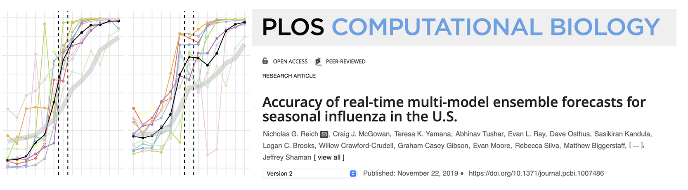
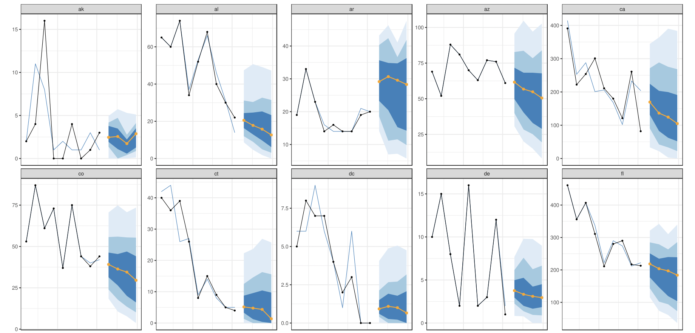
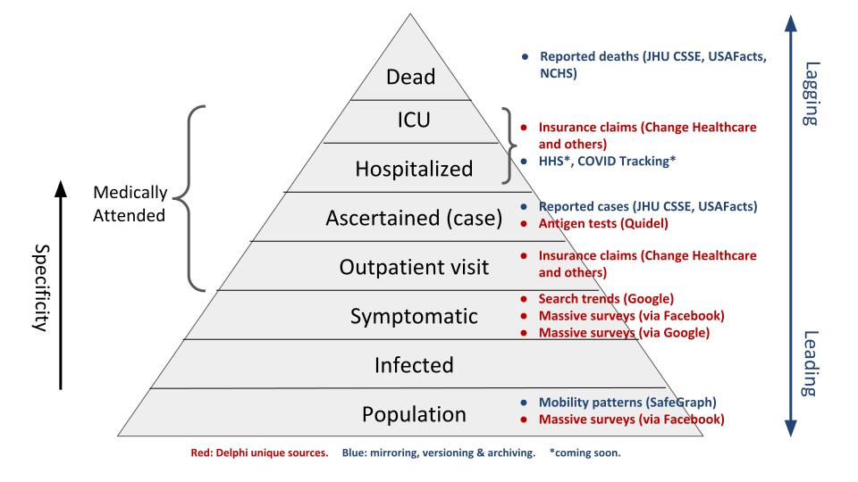

```{r setup, include=FALSE}
library(tidyverse)
library(lubridate)
library(fontawesome)
options(htmltools.dir.version = FALSE)
knitr::opts_chunk$set(
  dev = "svg",
  fig.path = "gfx/",
  fig.align = 'center',
  fig.width = 9, fig.height = 3.5, fig.retina = 3,
  fig.showtext = TRUE,
  out.width = "100%",
  cache = TRUE,
  autodep = TRUE,
  echo = FALSE,
  message = FALSE, 
  warning = FALSE,
  hiline = TRUE
)
```

```{r xaringan-themer, include=FALSE, warning=FALSE}
library(xaringanthemer)
primary = "#002145"
tertiary = "#6495ed"
secondary = "#ffa319"
fourth_color = "#DB0B5B"

style_duo_accent(
  primary_color      = primary,  #"#002145", # UBC primary
  secondary_color    = secondary,  #"6EC4E8", # UBC secondary 4
  header_font_google = google_font("Cormorant Garamond"),
  text_font_google = google_font("Montserrat"),
  code_font_google = google_font("Fira Mono"),
  text_color = primary,
  table_row_even_background_color = lighten_color(primary, 0.8),
  colors = c(
    tertiary = tertiary, fourth_color = fourth_color,
    light_pri = lighten_color(primary, 0.8),
    light_sec = lighten_color(secondary, 0.8),
    light_ter = lighten_color(tertiary, 0.8),
    light_fou = lighten_color(fourth_color, 0.8)
    ),
  outfile = here::here("src/xaringan-themer.css")
)
theme_set(theme_bw(base_size = 16))
xaringanExtra::use_scribble(
  pen_color = secondary,
  palette = c(primary, secondary, tertiary, fourth_color, 
              RColorBrewer::brewer.pal(6, "Set1"))
)
```

```{r cover, include=FALSE, fig.width=16, fig.height=4}
epipredict::case_death_rate_subset %>%
  filter(case_rate > 1) %>%
  ggplot(aes(time_value, case_rate, colour = geo_value)) +
  geom_line() +
  theme_void() +
  scale_color_viridis_d(option = "C") +
  scale_x_continuous(expand = expansion()) +
  scale_y_log10(expand = expansion(), limits = c(1, NA)) +
  theme(legend.position = "none",
        plot.background = element_rect(fill = primary))
```


layout: true

<div class="my-footer"><span><a href="https://dajmcdon.github.io/epi-modelling-calgary-2023" style="color:white">dajmcdon.github.io/epi-modelling-calgary-2023</a></span></div> 

---
background-image: url("gfx/cover-1.svg")
background-size: contain
background-position: top

<br/><br/><br/><br/><br/><br/><br/><br/><br/><br/>


# Statistical approaches to epidemic forecasting

## `r fontawesome::fa("code", fill=secondary)` Evaluation and software

<br>

###Daniel J. McDonald
###University of British Columbia
#### &nbsp;10 February 2023

---

## Mathematical modelling of disease / epidemics is very old 

* .tertiary[Daniel Bernoulli (1760)] - studies inoculation against smallpox

* .tertiary[John Snow (1855)] - cholera epidemic in London tied to a water pump

* .tertiary[Ronald Ross (1902)] - Nobel Prize in Medicine for work on malaria

* .tertiary[Kermack and McKendrick (1927-1933)] - basic epidemic (mathematical) model

.center[

]

---

## Forecasting is also old, but not that old

### US CDC Flu Challenge began in 2013

.center[

]

> CDC’s Influenza Division has collaborated each flu season with .tertiary[external researchers] on flu forecasting. <br>CDC has provided forecasting teams data, relevant public health forecasting targets, and forecast accuracy metrics while .tertiary[teams submit their forecasts], which are based on a variety of methods and data sources, each week.


---

## The Covid-19 Pandemic

* CDC pivoted their Flu Challenge to Covid-19 in June 2020

* Similar efforts in Germany and then Europe

.pull-left[

]

.pull-right[

]


* .secondary[Nothing similar for Canada]

* CDC now has Flu and Covid simultaneously

---

## Why the Forecast Hubs?

* Collect public forecasts in a standard format and visualize

* Used internally by CDC

* Turns out, most individual teams' forecasts are ... not great

* Combine submissions into an "Ensemble"



---
class: inverse, middle, center

# Standard forecasting models


---


```{r submitted-hosp, fig.height=4, fig.width=7}
hosp_summary <- readRDS("hosp-summary.rds")

ggplot(hosp_summary, 
       aes(x = forecast_date, y = forecaster, fill = n / 28)) +
  geom_tile() +
  theme_bw(base_size = 10) + xlab("") + ylab("") +
  scale_fill_viridis_c(name = "# states forecast") +
  scale_x_date(limits = lubridate::ymd(c("2022-01-01", NA))) +
  theme(legend.position = "bottom")
```

---

## Quick overview of types

.pull-left[
* BPagano - SIR 

* CMU - Time Series

* Colorado (4 versions) - SEIR, different scenarios

* Georgia Tech - Deep learning...

* IHME (rarely) - SEIR

* Johns Hopkins (3 in Applied Physics) - SEIR, Time series, ensemble

* Johns Hopkins (other, Infection Dynamics) - SEIR
]

.pull-right[
* Dean Karlen (Physicist at UVic) - SEIR type

* MOBS-Gleam - Agent based mobility model

* USC - SEIR

* UVA - Ensemble of VAR, LSTM, SEIR

* Prolix - "Offsets obtained by correlations, best linear approximation of reproduction rates (using vaccination  approximation) by least euclidean distance, and linear prediction."
]


.large.fourth-color[SIR-type]

.large.tertiary[Time series]

.secondary.large[Ensemble / Deep Learning / ML]

---

## Time series (simplification)

> On day $t$, model hospitalizations at day $t+a$ as a function of today's hospitalizations and those in the recent past.


.secondary[For example:]

$$\widehat{y}_{t+a} = a_{0} y_{t} + a_{7}y_{t-7} + a_{14} y_{t-14} + b_0 x_t + b_{7} x_{t-7}$$

.secondary[COVIDhub Baseline:]

$$\widehat{y}_{t+a} = y_{t}$$

* Seemingly, straightforward to do.
* Performs surprisingly well, most of the time.
* Not so good when you'd most want it to work.
* Uses essentially no information about epidemics.


---

## SIR-type (compartmental) models - Stochastic Version


.pull-left-wide[
Suppose each of N people in a bucket at time t:

1. .large[.primary[Susceptible(t)]] : not sick, but could get sick
1. .large[.secondary[Infected(t)]] : sick, can make others sick
1. .large[.tertiary[Removed(t)]] : either recovered or dead; not sick, can't get sick, can't make anyone sick


<hr>


**Assume**: During period h, each .primary[S] meets kh people.

**Assume**: Prob( .primary[S] meets .secondary[I] and becomes .secondary[I] ) = c.

.fourth-color[So]: Prob( .primary[S] $\rightarrow$ .secondary[I] ) = $1 - (1 - c I(t)  / N )^{hk} \approx kchI(t) / N$

.fourth-color[So]: New .secondary[I] in time h $\sim Binom(S(t),\ kchI(t) / N)$

**Assume**: Prob( .secondary[I] $\rightarrow$ .tertiary[R]) = $\gamma h$ 

.fourth-color[So]: new removals in time h $\sim Binom(I(t),\ \gamma h)$
]

.pull-right-narrow[

```{r sir-dag, echo = FALSE, fig.height=2}
library(visNetwork)
library(widgetframe)
sir <- tibble(id = 1:3, label = c(" S ", " I ", " R "), shape = "circle",
              color = c(primary, secondary, tertiary))
sire <- tibble(from = 1:2, to = 2:3, arrows = "to")
visNetwork(sir, sire) %>%
  visNodes(font = list(color = "#FAFAFA", size = 32)) %>%
  visHierarchicalLayout(direction = "UD") %>%
  frameWidget()
```

]


---

## SIR-type (compartmental) models - Stochastic Version

.pull-left-wide[

### Over-all equations:

\begin{aligned}
C(t+h) & =  \mathrm{Binom}\left(S(t),\ \frac{\beta}{N} h I(t)\right)\\
D(t+h) & =  \mathrm{Binom}\left(I(t),\ \gamma h\right)\\
S(t+h) & =  S(t) - C(t+h)\\
I(t+h) & =  I(t) + C(t+h) - D(t+h)\\
R(t+h) & =  R(t) + D(t+h)
\end{aligned}

### In the deterministic limit, $N\rightarrow\infty,\ h\rightarrow 0$

\begin{aligned}
N &= S(0) + I(0) + R(0)\\
\frac{dS}{dt} & =  -\frac{\beta}{N} S(t)I(t)\\
\frac{dI}{dt} & =  \frac{\beta}{N} I(t)S(t) - \gamma I(t)\\
\frac{dR}{dt} & =  \gamma I(t)
\end{aligned}

**"_the_ SIR model"** is often ambiguous between these

]

.pull-right-narrow[
```{r sir-dag-again, echo = FALSE}
visNetwork(sir, sire) %>%
  visNodes(font = list(color = "#FAFAFA", size = 32)) %>%
  visHierarchicalLayout(direction = "UD") %>%
  frameWidget()
```

]

---

## Data issues 

- **Ideally** we'd see .large[.primary[S], .secondary[I], .tertiary[R]] at all times

- Easier to observe new infections, .large[.secondary[I(t+h) - I(t)]]

- Removals by death are easier to observe than removals by recovery,  
  so we mostly see .large[.tertiary[(R(t+h) - R(t))] &times; (death rate)]

- The interval between measurements, say $\Delta$, is often $\gg h$

- Measuring .large[.secondary[I(t)]] and .large[.tertiary[R(t)]] (or their rates of change) is hard 
    + testing/reporting is sporadic and error prone
    + Need to model test error (false positives, false negatives) _and_ who gets tested
    + Need to model lag between testing and reporting
    
- Parameters (especially, $\beta$) change during the epidemic
    + Changing behavior, changing policy, environmental factors, vaccines, variants, ...

---

## Connecting to Data


- Likelihood calculations are straightforward if we can measure .large[.secondary[I(t)], .tertiary[R(t)]] at all times 0, h, 2h, &hellip; T

- Or .large[.secondary[I(0)]], .large[.tertiary[R(0)]] and all the increments .large[.secondary[I(t+h) - I(t)], .tertiary[R(t+h) - R(t)]]

- Still have to optimize numerically

- Likelihood calculations already become difficult if the time between observations $\Delta \gg h$
    + Generally, $\Delta \approx$ 1 day
    + In principle, this just defines another Markov process, with a longer interval $\Delta$ between steps, but to get the likelihood of a $\Delta$ step we have to sum over all possible paths of $h$ steps adding up to it

- Other complications if we don't observe all the compartments, and/or have a lot of noise in our observations
    + We don't and we do.


---

## Connecting to Data

.pull-left[

- Often more tractable to avoid likelihood  (Conditional least squares, simulation-based inference)

- Intrinsic issue: Initially, everything just looks exponential
    + So it's hard to discriminate between distinct models
    + So even assuming an SIR model, it's easier to estimate $\beta - \gamma$ than $(\beta, \gamma)$ or $\beta/\gamma$

- Can sometimes **calibrate** or fix the parameters based on other sources
    + E.g., $1/\gamma =$ average time someone is infectious, which could be determined from clinical studies / observations
]

.pull-right[
<blockquote class="twitter-tweet"><p lang="en" dir="ltr">I have been thinking about how different people interpret data differently. And made this xkcd style graphic to illustrate this. <a href="https://t.co/a8LvlmZxT7">pic.twitter.com/a8LvlmZxT7</a></p>&mdash; Jens von Bergmann (@vb_jens) <a href="https://twitter.com/vb_jens/status/1372251931444350976?ref_src=twsrc%5Etfw">March 17, 2021</a></blockquote>
]


---

## These models fit well "in sample"

.pull-left[
* Track observed cases closely (they should)

* Can provide nuanced policy advice on some topics

* Many questions depend on modulating $\beta$
    1. What happens if we lock down?
    2. What happens if we mask?
    3. What happens if we have school online?
    4. Vaccine passport?
    
* Vaccination modeling is easier, directly removes susceptibles

* What about out-of-sample?
]


.pull-right[.center[
`r fontawesome::fa("exclamation-circle", fill="orange", height="20em")`
]]

---
background-image: url("covidseir-fcast.pdf")
background-position: center
background-size: contain

---
background-image: url("pypm-fcast.pdf")
background-position: center
background-size: contain


---
class: inverse, middle, center

# So how do they do? <br> Out-of-sample COVID Forecasting


---

## The forecast format


* Various targets "incident deaths", "incident cases", "hospital admissions"

* Produce point forecasts 

* Quantiles to measure uncertainty (set of 23)

* Predict 1-4 epiweeks ahead (or 1-28 days)


```{r}
source("ca-trajectory.R")
ca_traj
```

---

## Forecast evaluation

[Weighted Interval Score (Bracher et al., 2000)](https://arxiv.org/abs/2005.12881)

$$WIS = \frac{2}{K} \sum_{k=1}^K \max\{\tau_k (y - q_k), (1-\tau_k)(q_k - y)\}$$

.pull-left[
* Calculated for each target   
(forecast date, location, horizon)

* For each Interval:
    1. Width of interval.
    1. Under prediction (AE to the top)
    1. Over prediction (AE to the bottom)

* Weighted average using probability content

* Mathematically equivalent to an average of quantile losses

* Discrete approximation of CRPS
]

.pull-right[

```{r, fig.width=4}

ca_traj
```

]

---

## Comparing across space and time

```{r setup-aws}
library(aws.s3)
Sys.setenv("AWS_DEFAULT_REGION" = "us-east-2")
s3bucket <- get_bucket("forecast-eval")
death_scores <- s3readRDS("score_cards_state_deaths.rds", s3bucket) %>%
  select(ahead:forecaster, target_end_date, wis) %>%
  mutate(forecast_date = target_end_date - 7 * ahead)
dump <- death_scores %>% group_by(forecaster) %>% summarise(n = n()) %>%
  filter(n > 4 * 4 * 50 * 4, forecaster != "COVIDhub-ensemble")
death_scores <- death_scores %>% 
  filter(forecaster %in% pull(dump, forecaster))

baseline <- death_scores %>% filter(forecaster == "COVIDhub-baseline")
death_scores <- left_join(
  death_scores %>% filter(forecaster != "COVIDhub-baseline"),
  baseline %>% rename(base_wis = wis) %>% 
    select(forecast_date, target_end_date, geo_value, base_wis),
)
```


.pull-left[

* Error proportional to cases

* Large right skew

* "Adjust" by scaling to a Baseline

* Baseline is flat line + residual quantiles

```{r wis-map, fig.width=2.75, fig.height=2}
library(covidcast)
Mean <- function(x) mean(x, na.rm = TRUE)
GeoMean <- function(x, y = NULL, offset = 0) {
  x <- x + offset
  if (!is.null(y)) y <- y + offset
  else y <- 1
  exp(Mean(log(x / y)))
}
cmu_death_map <- death_scores %>%
  filter(forecaster == "CMU-TimeSeries", ahead == 3) %>%
  group_by(geo_value) %>%
  summarize(value = Mean(wis)) %>%
  mutate(time_value = Sys.Date()) %>%
  as.covidcast_signal(signal = "wis", data_source = "CMU-TimeSeries",
                      geo_type = "state")

plot(cmu_death_map, choro_col = scales::viridis_pal()(3), 
     title = "Mean of WIS (all CMU forecasts)") + 
  theme_void(base_size = 8) + 
  theme(legend.position = "bottom", legend.margin = margin(0,1,0,1,"cm"))

```

]

.pull-right[


```{r wis-densities, fig.width=4}
death_scores %>%
  filter(ahead == 3) %>%
  ggplot(aes(wis, fill = forecaster, color = forecaster)) + 
  geom_density(alpha = .2) +
  scale_fill_viridis_d() +
  scale_color_viridis_d() +
  theme_bw() +
  theme(legend.position = "none") +
  scale_x_log10(labels = scales::label_number_si()) +
  coord_cartesian(xlim = c(.1, 1e5))
```


]

---

## Performance over time (Incident Deaths)

```{r death-scores-all, fig.height=4.5}
library(gghighlight)
selected <- c("COVIDhub-4_week_ensemble", "Karlen-pypm", "CMU-TimeSeries",
              "COVIDhub-trained_ensemble")
death_scores %>%
  group_by(forecaster, target_end_date, ahead) %>%
  summarise(relwis = GeoMean(wis, base_wis, offset = 1)) %>%
  ggplot(
    aes(target_end_date, relwis, color = forecaster, group = forecaster)) +
  facet_wrap(~ahead, labeller = label_both) +
  geom_line() +
  geom_hline(yintercept = 1, color = "black", size = 1.5) +
  gghighlight(forecaster %in% selected, use_direct_label = FALSE) +
  ylab("Geometric Mean of WIS\n relative to baseline") +
  xlab("Target date") +
  theme_bw() +
  coord_cartesian(ylim = c(.5, 2)) +
  scale_color_viridis_d(begin = .1, end = .85, option = "A") +
  theme(legend.position = "bottom", legend.title = element_blank())
```

---

## Overall performance (Incident Deaths)
#### All forecasters with at least 4 months of submissions

```{r overall-death, fig.height=4}
death_scores %>%
  group_by(forecaster, ahead) %>%
  summarise(relwis = GeoMean(wis, base_wis, offset = 1)) %>%
  ggplot(
    aes(ahead, relwis, color = forecaster)) +
  geom_line() +
  geom_hline(yintercept = 1, color = "black", size = 1.5) +
  gghighlight(forecaster %in% selected, 
              label_params = list(min.segment.length = Inf)) +
  ylab("Geometric Mean of WIS\n relative to baseline") +
  xlab("Weeks ahead") +
  theme_bw() +
  scale_color_viridis_d(begin = .1, end = .85, option = "A")
```

---

## What about Incident Cases?

```{r grab-cases}
case_scores <- s3readRDS("score_cards_state_cases.rds", s3bucket) %>%
  select(ahead:forecaster, target_end_date, wis) %>%
  mutate(forecast_date = target_end_date - 7 * ahead)
dumpc <- case_scores %>% group_by(forecaster) %>% summarise(n = n()) %>%
  filter(n > 4 * 4 * 50 * 4, forecaster != "COVIDhub-ensemble")
case_scores <- case_scores %>% 
  filter(forecaster %in% pull(dumpc, forecaster))
base_case <- case_scores %>% filter(forecaster == "COVIDhub-baseline")
case_scores <- left_join(
  case_scores %>% filter(forecaster != "COVIDhub-baseline"),
  base_case %>% rename(base_wis = wis) %>% 
    select(forecast_date, target_end_date, geo_value, base_wis)) %>% 
  group_by(forecaster, ahead) %>%
  summarise(relwis = GeoMean(wis, base_wis, offset = 1))
```

```{r overall-cases, fig.height=4.5}
ggplot(case_scores,
    aes(ahead, relwis, color = forecaster)) +
  geom_line() +
  geom_hline(yintercept = 1, color = "black", size = 1.5) +
  gghighlight(forecaster %in% selected, use_direct_label = FALSE) +
  ylab("Geometric Mean of WIS\n relative to baseline") +
  xlab("Weeks ahead") +
  theme_bw() +
  scale_color_viridis_d(begin = .1, end = .85, option = "A") +
  theme(legend.position = "bottom", legend.title = element_blank())
```

---

## What about Hospital Admissions?

```{r grab-hosp}
hosp_scores <- s3readRDS("score_cards_state_hospitalizations.rds", s3bucket) %>%
  select(ahead:forecaster, target_end_date, forecast_date, wis)
dumph <- hosp_scores %>% group_by(forecaster) %>% summarise(n = n()) %>%
  filter(n > 4 * 28 * 50 * 4, forecaster != "COVIDhub-ensemble")
hosp_scores <- hosp_scores %>% 
  filter(forecaster %in% pull(dumph, forecaster))
base_hosp <- hosp_scores %>% filter(forecaster == "COVIDhub-baseline")
hosp_scores <- left_join(
  hosp_scores %>% filter(forecaster != "COVIDhub-baseline"),
  base_hosp %>% rename(base_wis = wis) %>% 
    select(forecast_date, target_end_date, geo_value, base_wis)) %>% 
  group_by(forecaster, ahead) %>%
  summarise(relwis = GeoMean(wis, base_wis, offset = 1))
```

```{r overall-hosp, fig.height=4.5}
ggplot(hosp_scores, aes(ahead, relwis, color = forecaster)) +
  geom_line() +
  geom_hline(yintercept = 1, color = "black", size = 1.5) +
  gghighlight(forecaster %in% selected, use_direct_label = FALSE) +
  ylab("Geometric Mean of WIS\n relative to baseline") +
  xlab("Days ahead") +
  theme_bw() +
  scale_color_viridis_d(begin = .1, end = .85, option = "A") +
  theme(legend.position = "bottom", legend.title = element_blank())
```


---
class: middle, center, h2

Live evaluation dashboard

<https://delphi.cmu.edu/forecast-eval/>


---
class: middle, center, inverse

# Gaps in forecasting

---

## Predicting surges in Florida

<iframe src="https://ubc-stat-dajmcdon.shinyapps.io/fl-fcast-visualizer/" width="100%" height="700px" style="border:none"></iframe>

---

## PI Coverage

```{r coverage-plot, fig.height=4.5}
case_cov <- readRDS("cases-coverage.rds")
death_cov <- readRDS("deaths-coverage.rds")
bind_rows(cases = case_cov, deaths = death_cov, .id = "target") %>%
  ggplot(aes(target_end_date, cov, color = forecaster)) +
  geom_line() + geom_point(size = .25) +
  geom_hline(yintercept = 0.95, linetype = "dashed") +
  scale_y_continuous(name = "95% PI coverage", limits = c(0,1)) +
  scale_x_date(date_breaks = "6 months", date_labels = "%b %Y") +
  xlab("Target date of forecast") +
  scale_color_viridis_d(begin = .1, end = .9) +
  theme(legend.position = "none") +
  facet_grid(target ~ ahead, 
             labeller =  labeller(ahead = label_both)) +
  theme_bw() +
  theme(legend.position = "bottom", legend.title = element_blank())
```

---

## The terrible case of Ohio

```{r oh-asof, fig.height=4.5}
oh_final <- covidcast::covidcast_signal(
  "jhu-csse", "deaths_7dav_incidence_num", geo_type = "state", 
  geo_values = "oh") %>% 
  select(time_value, value)
oh_15 <- covidcast::covidcast_signal(
  "jhu-csse", "deaths_7dav_incidence_num", geo_type = "state", 
  geo_values = "oh", as_of = "2021-02-15") %>%
  select(time_value, value) %>%
  rename(`Feb 15` = value)
oh_20 <- covidcast::covidcast_signal(
  "jhu-csse", "deaths_7dav_incidence_num", geo_type = "state", 
  geo_values = "oh", as_of = "2021-02-20") %>%
  select(time_value, value) %>%
  rename(`Feb 20` = value)
oh_31 <- covidcast::covidcast_signal(
  "jhu-csse", "deaths_7dav_incidence_num", geo_type = "state", 
  geo_values = "oh", as_of = "2021-03-01") %>% 
  select(time_value, value) %>%
  rename(`Mar 1` = value)
oh <- left_join(oh_final %>% rename(today = value), oh_31) %>% 
  left_join(oh_15) %>% left_join(oh_20) %>%
  pivot_longer(-time_value)
```


```{r plot-oh, fig.height=4.5}
ggplot(oh, aes(time_value, value, color = name)) +
  geom_line() +
  ylab("OH Daily Deaths\n7-day trailing average") +
  xlab("Date") +
  theme_bw() +
  theme(legend.position = "bottom", legend.title = element_blank()) +
  scale_color_brewer(palette = "Set1") +
  coord_cartesian(xlim = ymd("2020-11-01", "2021-03-01")) +
  geom_vline(xintercept = ymd("2021-02-15"), linetype = "dashed")
```

---

## The terrible case of Ohio

```{r bad-forecast, fig.height=4.5, message=FALSE}
ugh <- get_covidhub_predictions(
  "epiforecasts-ensemble1", "2021-02-15", 
  signal = "deaths_incidence_num", geo_values = "oh")
ugh <- ugh %>% filter(is.na(quantile) | 
                        abs(quantile - .025) < 1e-3 |
                        abs(quantile - .975) < 1e-3) %>%
  mutate(hlp = case_when(
    is.na(quantile) ~ "point",
    abs(quantile - .025) < 1e-4 ~ "lo",
    TRUE ~ "hi"
  )) %>%
  select(target_end_date, value, hlp) %>%
  pivot_wider(names_from = hlp, values_from = value)
ggplot() +
  geom_line(data = oh_final %>% 
              mutate(geo_value = "oh") %>% 
              evalcast:::sum_to_epiweek(), aes(time_value, value)) +
  geom_line(data = oh_15 %>% 
              mutate(geo_value = "oh") %>% 
              rename(value = `Feb 15`) %>%
              evalcast:::sum_to_epiweek() %>%
              filter(time_value < "2021-02-16"), 
            aes(time_value, value),
            color = "grey50") +
  geom_point(data = oh_final %>% 
         mutate(geo_value = "oh") %>% 
         evalcast:::sum_to_epiweek(), aes(time_value, value)) +
  geom_line(data = ugh, aes(target_end_date, point), color = primary) +
  geom_point(data = ugh, aes(target_end_date, point), color = primary) +
  # geom_ribbon(data = ugh, 
  #             aes(x = target_end_date, ymin = lo, ymax = hi), 
  #             fill = primary, alpha=.4) +
  scale_y_log10(labels = scales::label_number_si(), 
                name = "Total Deaths per week") +
  scale_x_date(name = "Date", date_labels = "%b %Y") +
  geom_vline(xintercept = ymd("2021-02-15"), linetype = "dashed") +
  coord_cartesian(xlim = ymd("2020-11-01", "2021-04-01")) +
  theme_bw()
```

---
class: inverse, middle, center

# Forecasting lessons

---

## Forecasting lessons

Human in the loop

```{r, out.height = "90%"}
knitr::include_graphics("manual-corrections.png")
```

---

## Forecasting lessons

Human in the loop

```{r, out.width="90%"}

```

---

## Forecasting lessons


Simple models [M, Bien, Green, Hu, ..., Tibshirani](http://medrxiv.org/content/10.1101/2021.06.22.21259346v1)

```{r}
case_scores <- s3readRDS("score_cards_state_cases.rds", s3bucket) %>%
  select(ahead:forecaster, target_end_date, wis) %>%
  mutate(forecast_date = target_end_date - 7 * ahead)
dumpc <- case_scores %>% group_by(forecaster) %>% summarise(n = n()) %>%
  filter(n > 4 * 4 * 50 * 4, forecaster != "COVIDhub-ensemble")
case_scores <- case_scores %>% 
  filter(
    forecaster %in% pull(dumpc, forecaster), forecast_date < "2021-04-01")
base_case <- case_scores %>% filter(forecaster == "COVIDhub-baseline")
case_scores <- left_join(
  case_scores %>% filter(forecaster != "COVIDhub-baseline"),
  base_case %>% rename(base_wis = wis) %>% 
    select(forecast_date, target_end_date, geo_value, base_wis)) %>% 
  group_by(forecaster, ahead) %>%
  summarise(relwis = GeoMean(wis, base_wis, offset = 1))
rm(base_case)
hrrs <- readRDS("hrr-forecasts.rds")
```

```{r add-hrr, fig.height=4.5}
ggplot() +
  geom_line(data = case_scores %>% filter(ahead < 4), 
            aes(ahead * 7, relwis, group = forecaster), color = "grey80") +
  geom_hline(yintercept = 1) +
  geom_line(data = case_scores %>% 
              filter(ahead < 4, forecaster == "COVIDhub-4_week_ensemble"), 
            aes(ahead * 7, relwis), color = tertiary, size = 1.5) +
  geom_line(data = hrrs, aes(ahead, relwis, color = forecaster)) +
  geom_point(data = hrrs, aes(ahead, relwis, color = forecaster)) +
  ylab("Geometric mean of WIS relative to baseline\nbefore April 2021") +
  xlab("Days ahead") + theme_bw() +
  theme(legend.position = "bottom", legend.title = element_blank()) +
  scale_color_viridis_d()
```

---
class: inverse, middle, center

# Software for signal processing and simple models

---

## `{epiprocess}`

<https://cmu-delphi.github.io/epiprocess/>

1. Data types

    * `epi_df` &mdash; basically a `data.frame` but with important meta information
        1. `as_of` tag to denote the data vintage
        2. time type
        3. geo type
        4. additional keys (e.g., age, gender, race)
    * `epi_archive` &mdash; a collection of `epi_df`s of different vintages
        * But stored so as to eliminate redundancies
        * Allows for important operations (filling, merging, snapshots,  )
        
2. Fundamental functionality &mdash; the `slide()`

    * Rolling correlations
    * Moving averages
    * outlier correction
    * arbitrary functions
    
---

## Example of `slide()`

```{r, include=FALSE}
library(epidatr)
library(epiprocess)
x <- covidcast(
  data_source = "jhu-csse",
  signals = "confirmed_7dav_incidence_num",
  time_type = "day",
  geo_type = "state",
  time_values = epirange(20210601, 20220901),
  geo_values = "ga,pa") %>%
  fetch_tbl() %>%
  select(geo_value, time_value, cases = value) %>%
  arrange(geo_value, time_value) %>%
  as_epi_df()
```

```{r, echo=TRUE}
x <- x %>%  # covid cases in 2 locations downloaded with `{epidatr}`
  group_by(geo_value) %>% 
  mutate(smooth_spline = growth_rate(time_value, cases, method = "smooth_spline"),
         trend_filter = growth_rate(time_value, cases, method = "trend_filter"))
```


```{r, echo=FALSE}
x %>%
  select(geo_value, time_value, cases) %>%
  ggplot(aes(x = time_value, y = cases)) + 
  geom_line(colour = secondary) + 
  facet_wrap(~geo_value, scales = "free_y", ncol = 2) +
  scale_x_date(minor_breaks = "month", date_labels = "%b %y") +
  labs(x = "", y = "Incident cases (7 dav)") +
  theme_bw() +
  theme(legend.position = "bottom")
```

---
## Example of `slide()`

```{r, echo=TRUE, eval=FALSE}
x <- x %>%  # covid cases in 2 locations downloaded with `{epidatr}`
  group_by(geo_value) %>% 
  mutate(smooth_spline = growth_rate(time_value, cases, method = "smooth_spline"),
         trend_filter = growth_rate(time_value, cases, method = "trend_filter"))
```


```{r, echo=FALSE}
x %>%
  select(geo_value, time_value, smooth_spline, trend_filter) %>%
  pivot_longer(smooth_spline:trend_filter) %>%
  ggplot(aes(x = time_value, y = value)) + 
  geom_line(aes(col = name)) + 
  scale_color_manual(values = c(3,6)) +
  facet_wrap(~geo_value, scales = "free_y", ncol = 2) +
  scale_x_date(minor_breaks = "month", date_labels = "%b %y") +
  labs(x = "", y = "Growth rate", col = "Method") +
  theme(legend.position = "bottom") +
  theme_bw()
```

---

## Outlier detection

```{r, echo=FALSE}
x <- covidcast(
  data_source = "jhu-csse",
  signals = "confirmed_incidence_num",
  time_type = "day",
  geo_type = "state",
  time_values = epirange(20210601, 20220901),
  geo_values = "pa") %>%
  fetch_tbl() %>%
  select(geo_value, time_value, cases = value) %>%
  arrange(geo_value, time_value) %>%
  as_epi_df()
```

```{r, echo=TRUE}
x <- x %>% mutate(outliers = detect_outlr_rm(time_value, cases)) 
# uses rolling median, but lots of fancy alternative options
```

```{r, echo=FALSE, fig.height=4}
outlier_facets =
  c("Points outside bands are marked as outliers",
    "Replacement values are available for simple outlier corrections") %>%
  {factor(., levels=.)} # (to avoid facet alphabetization)
x %>% ungroup() %>%
  unpack(outliers) %>%
  filter(geo_value == "pa") %>%
  mutate(facet = outlier_facets[[1L]]) %>%
  ggplot(aes(time_value, cases, ymin = lower, ymax = upper)) +
  geom_line() + labs("incident cases (PA)") +
  geom_ribbon(colour = fourth_color, linetype="dashed", fill = NA) +
  facet_wrap(~ facet, ncol=1L) + xlab("") +
  geom_point(data = function(df) df %>% filter(cases != replacement) %>%
                                   mutate(facet = outlier_facets[[2L]]),
             colour=secondary) +
  geom_line(aes(y = replacement),
            data = function(df) df %>% mutate(facet = outlier_facets[[2L]]),
            colour = primary) +
  theme_bw()
```

---

## Examining an `epi_archive`

```{r, echo=FALSE}
x <- archive_cases_dv_subset
x_latest <- epix_as_of(x, max_version = max(x$DT$version))
self_max = max(x$DT$version)
versions = seq(as.Date("2020-06-01"), self_max - 1, by = "1 month")
snapshots <- map_dfr(versions, function(v) { 
  epix_as_of(x, max_version = v) %>% mutate(version = v)}) %>%
  bind_rows(x_latest %>% mutate(version = self_max)) %>%
  mutate(latest = version == self_max) %>%
  filter(geo_value %in% c("ca", "fl"))

ggplot(snapshots %>% filter(!latest),
            aes(x = time_value, y = percent_cli)) +  
  geom_line(aes(color = factor(version))) + 
  geom_vline(aes(color = factor(version), xintercept = version), lty = 2) +
  facet_wrap(~ geo_value, scales = "free_y", nrow = 1) +
  scale_x_date(minor_breaks = "month", date_labels = "%b %y") +
  labs(x = "Date", y = "% of doctor's visits with CLI") + 
  theme(legend.position = "none") +
  geom_line(data = snapshots %>% filter(latest),
               aes(x = time_value, y = percent_cli), 
               inherit.aes = FALSE, color = "black") +
  theme_bw()
```

* Easy to inspect revision behaviour

* Can use it for pseudo-prospective forecasts

---
class: middle, center, inverse

# `{epipredict}`

<https://cmu-delphi.github.io/epipredict>

---

### .tertiary[A set of basic, easy-to-use forecasters that work out of the box.]
    
You should be able to do a reasonably limited amount of
customization on them. For the basic forecasters, we currently
provide:

- Baseline flat-line forecaster

- Autoregressive forecaster

- Autoregressive classifier

### .tertiary[A framework for creating custom forecasters out of modular components.]

1. .secondary[Preprocessor]: do things to the data before model training

2. .secondary[Trainer]: train a model on data, resulting in a fitted model object

3. .secondary[Predictor]: make predictions, using a fitted model object

4. .secondary[Postprocessor]: do things to the predictions before returning

---


---
class: middle, inverse, center

# Thoughts and thanks

---

## Thoughts without pictures

.pull-left[

* **Data is trouble**
    1. Both groups spend lots of time dealing with this
    2. Nowcasting
    3. Low SNR
    4. Very nonstationary
    
* **Forecast evaluation is not settled**
    1. WIS is equivalent to quantile loss, should use that.
    2. Not optimized to predict turning points. 
    3. How do we create ensembles?

]

.pull-right[

* **Hugely important to backtest properly**
    1. Data is constantly revised
    2. We see up to 10% "improvement" if we use finalized data
    3. Bigger deal in the US

* **Understanding the spatio-temporal dynamics is open**
    1. How do "waves" propagate?
    2. How important is mixing?
    3. Effects of schooling?
    4. Seasonality?
    
* **True Counterfactual causal inference is open**

* **Massive survey dataset**

]

---

## Delphi data



---

## Many thanks

* Jens, Dean, Dan, Sally and [BC COVID Modelling group](https://bccovid-19group.ca)

* Jacob, Ryan, Rob, Larry, Valerie, Addison, Alden, Ken, Mike, Jed and the rest of [Delphi](https://delphi.cmu.edu/)

* Shuyi, Wei (UBC Stat), Bryn (UBC Stat / BCCOVID)

* Funding from NSERC, CANSSI

* I get to benefit from the results of funding from Google, Facebook, Amazon, Change Healthcare, Quidel, SafeGraph, Qualtrics (you can too!)

* Forecast evaluation from [Reich Lab](http://covid19forecasthub.org) and [Delphi](https://delphi.cmu.edu/forecast-eval/)

<hr>

--


.center[

**Questions**

On these or other issues.
]

---
class: middle, center, inverse

# Extras


---

```{r sim-sir, echo = FALSE}
sim_SIR <- function(N = 1000, beta = .1, gamma = .01, TT = 800) {
    states <- matrix(NA, ncol = 3, nrow = TT, dimnames = list(NULL, c("S", "I", "R")))
    states[1 , ] <- c(N - 1, 1, 0)
    for (tt in 2:TT) {
        contagions <- rbinom(1, size = states[tt - 1, "S"], prob = beta * states[tt - 1, "I"] / N)
        removals <- rbinom(1, size=states[tt - 1, "I"], prob = gamma)
        states[tt, "S"] <- states[tt - 1, "S"] - contagions
        states[tt, "I"] <- states[tt - 1, "I"] + contagions - removals
        states[tt, "R"] <- states[tt - 1, "R"] + removals
    }
    data.frame(states)
}    
```

```{r sim-sir-plot, fig.height=2.5}
sim_SIR() %>% mutate(time = 1:n()) %>% pivot_longer(-time) %>%
  mutate(name = fct_relevel(name, "S")) %>%
  ggplot(aes(time, value, color = name)) +
  geom_line() +
  theme_bw() + ylab("# in compartment") +
  scale_color_brewer(palette = "Dark2") +
  theme(legend.title = element_blank())
```


---

## `{epiprocess}`

<https://cmu-delphi.github.io/epiprocess/>

1. Data types

    * `epi_df` &mdash; basically a `data.frame` but with important meta information
        1. `as_of` tag to denote the data vintage
        2. time type
        3. geo type
        4. additional keys (e.g., age, gender, race)
    * `epi_archive` &mdash; a collection of `epi_df`s of different vintages
        * But stored so as to eliminate redundancies
        * Allows for important operations (filling, merging, snapshots,  )
        
2. Fundamental functionality &mdash; the `slide()`

    * Rolling correlations
    * Moving averages
    * outlier correction
    * arbitrary functions
    
---

## Example of `slide()`

```{r epidatr-ex, include=FALSE}
library(epidatr)
library(epiprocess)
library(dplyr)
library(tidyr)
x <- covidcast(
  data_source = "jhu-csse",
  signals = "confirmed_7dav_incidence_num",
  time_type = "day",
  geo_type = "state",
  time_values = epirange(20210601, 20220901),
  geo_values = "ga,pa") %>%
  fetch_tbl() %>%
  select(geo_value, time_value, cases = value) %>%
  arrange(geo_value, time_value) %>%
  as_epi_df()
```

```{r, echo=TRUE}
x <- x %>%  # covid cases in 2 locations downloaded with `{epidatr}`
  group_by(geo_value) %>% 
  mutate(smooth_spline = growth_rate(time_value, cases, method = "smooth_spline"),
         trend_filter = growth_rate(time_value, cases, method = "trend_filter"))
```

```{r, echo=FALSE}
x %>%
  select(geo_value, time_value, smooth_spline, trend_filter) %>%
  pivot_longer(smooth_spline:trend_filter) %>%
  ggplot(aes(x = time_value, y = value)) + 
  geom_line(aes(col = name)) + 
  scale_color_manual(values = c(3,6)) +
  facet_wrap(~geo_value, scales = "free_y", ncol = 2) +
  scale_x_date(minor_breaks = "month", date_labels = "%b %y") +
  labs(x = "Date", y = "Growth rate", col = "Method") +
  theme_bw(base_size = 14) +
  theme(legend.position = "bottom")
```

---

## Examining an `epi_archive`

```{r, echo=FALSE}
x <- archive_cases_dv_subset
x_latest <- epix_as_of(x, max_version = max(x$DT$version))
self_max = max(x$DT$version)
versions = seq(as.Date("2020-06-01"), self_max - 1, by = "1 month")
snapshots <- map_dfr(versions, function(v) { 
  epix_as_of(x, max_version = v) %>% mutate(version = v)}) %>%
  bind_rows(x_latest %>% mutate(version = self_max)) %>%
  mutate(latest = version == self_max) %>%
  filter(geo_value %in% c("ca", "fl"))

ggplot(snapshots %>% filter(!latest),
            aes(x = time_value, y = percent_cli)) +  
  geom_line(aes(color = factor(version))) + 
  geom_vline(aes(color = factor(version), xintercept = version), lty = 2) +
  facet_wrap(~ geo_value, scales = "free_y", nrow = 1) +
  scale_x_date(minor_breaks = "month", date_labels = "%b %y") +
  labs(x = "Date", y = "% of doctor's visits with CLI") + 
  theme(legend.position = "none") +
  geom_line(data = snapshots %>% filter(latest),
               aes(x = time_value, y = percent_cli), 
               inherit.aes = FALSE, color = "black")
library(workflows)
```

* Easy to inspect revision behaviour
* Can use it for pseudo-prospective forecasts
* Compare to our procedure for the PNAS article &mdash; store every version as a `.csv` and load them individually

---
class: middle, center, inverse

# `{epipredict}`

<https://cmu-delphi.github.io/epipredict>

---

## Goals

1.  A set of basic, easy-to-use forecasters that work out of the box.
    You should be able to do a reasonably limited amount of
    customization on them. 
    -   Baseline flat-line forecaster
    -   Autoregressive forecaster
    -   Autoregressive classifier 
    
2.  A .secondary[framework] for creating custom forecasters out of modular
    components. 
    

### Users

.secondary[Basic.] Has data, calls forecaster with default arguments.

.secondary[Intermediate.] Wants to examine changes to the arguments, take advantage of built in flexibility.

.secondary[Advanced.] Wants to write their own forecasters. Maybe willing to build up from some components that we write.

---

## Basic autoregressive forecaster

* Predict `deaths` 1-week ahead on 0, 7, 14 day lags of cases and deaths. 
* Use `lm`, produce intervals with residual quantiles.

```{r, echo = TRUE, warning=FALSE}
library(epipredict)
jhu <- case_death_rate_subset %>% filter(time_value > max(time_value) - 60)
canned <- arx_forecaster(jhu, outcome = "death_rate", 
                         predictors = c("case_rate", "death_rate"))
canned$predictions
```

---

```{r, echo = TRUE}
minor_changes <- arx_forecaster(
  jhu, outcome = "death_rate", predictors = c("case_rate", "death_rate"),
  args_list = arx_args_list(
    ahead = 14, lags = list(c(0:4, 7, 14), c(0, 7, 14)),
    levels = c(0.05, 1:9/10, 0.95),
    quantile_by_key = "geo_value"
  )
)
minor_changes$predictions
```


---

### Use random forests instead

```{r, echo = TRUE}
rf <- arx_forecaster(
  jhu, outcome = "death_rate", predictors = c("case_rate", "death_rate"),
  trainer = parsnip::rand_forest(mode = "regression"), # use ranger
  args_list = arx_args_list(
    ahead = 14, lags = list(c(0:4, 7, 14), c(0, 7, 14)),
    levels = c(0.05, 1:9/10, 0.95),
    quantile_by_key = "geo_value"
  )
)
```


### Or boosting

```{r, echo=TRUE}
xgb <- arx_forecaster(
  jhu, outcome = "death_rate", predictors = c("case_rate", "death_rate"),
  trainer = parsnip::boost_tree(mode = "regression", trees = 20), # use xgboost
  args_list = arx_args_list(
    ahead = 14, lags = list(c(0:4, 7, 14), c(0, 7, 14)),
    levels = c(0.05, 1:9/10, 0.95),
    quantile_by_key = "geo_value"
  )
) 
```

---

## Examine the model

```{r, echo=TRUE}
lmobj <- extract_fit_engine(canned$epi_workflow)
summary(lmobj)
```


